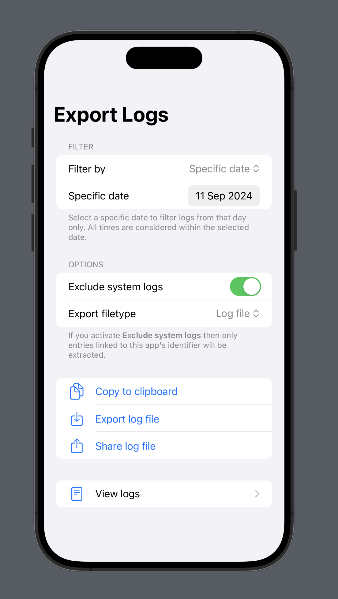

<!-- markdownlint-disable MD033 MD041 -->
<div align="center">

# SimpleLoggerUI


</div>

`SimpleLoggerUI` is a Swift package that provides a set of convenient SwiftUI views to easily integrate logging functionalities into your iOS or macOS applications. This package allows developers to display, filter, and export log entries without the need to build custom interfaces from scratch.

Features

- **Filtering:** Easily filter logs by categories, levels, and search text.
- **Exporting:** Export logs in multiple formats, including `.log`, `.json`, `.md`, `.txt`, and `.csv`.
- **User Friendly:** Intuitive and accessible UI components for seamless integration into your application.

## Installation

Add `SimpleLoggerUI` to your Swift project using Swift Package Manager.

```swift
dependencies: [
  .package(url: "https://github.com/markbattistella/SimpleLoggerUI", from: "1.0.0")
]
```

Alternatively, you can add `SimpleLoggerUI` using Xcode by navigating to `File > Add Packages` and entering the package repository URL.

## Usage

### LogExportScreen

`LogExportScreen` provides a user interface for exporting log entries with various filtering options, making it easy to select specific logs and export them in the desired format.

> [!Important]
> `SimpleLoggerUI` requires the `SimpleLogger` package, which is added by default. `SimpleLogger` provides all the OS logging logic.

```swift
import SwiftUI
import SimpleLogger
import SimpleLoggerUI

struct ContentView: View {
  @StateObject private var loggerManager = LoggerManager()

  var body: some View {
    NavigationView {
      LogExportScreen(vm: loggerManager)
    }
  }
}
```

### LogListScreen

`LogListScreen` displays log entries in a searchable list format, allowing users to browse, search, and filter logs by categories and levels.

> [!Note]
> `LogListScreen` is already included in `LogExportScreen`. Use the list screen if you want to use it standalone without the export view.

```swift
import SwiftUI
import SimpleLoggerUI

struct ContentView: View {
  @State private var logs: [OSLogEntryLog] = []

  var body: some View {
    NavigationView {
      LogListScreen(logs: logs)
    }
  }
}
```

## Examples

### Video - iOS

[LogExportScreen demo video](https://github.com/user-attachments/assets/9aea2fb6-a471-400a-ba47-85b1f9e90884)

### Images

|||
|-|-|
|  |  |
|  |  |

## Contributing

Contributions are welcome! Please fork the repository and submit a pull request for any features, fixes, or improvements.

## License

`SimpleLoggerUI` is available under the MIT license. See the LICENSE file for more information.
